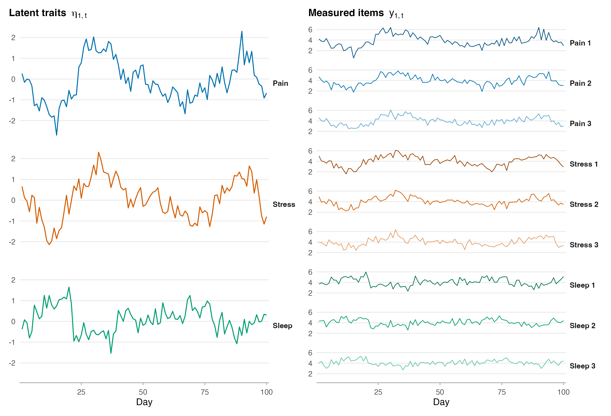
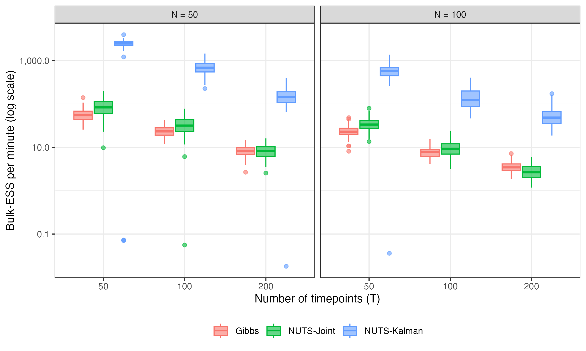
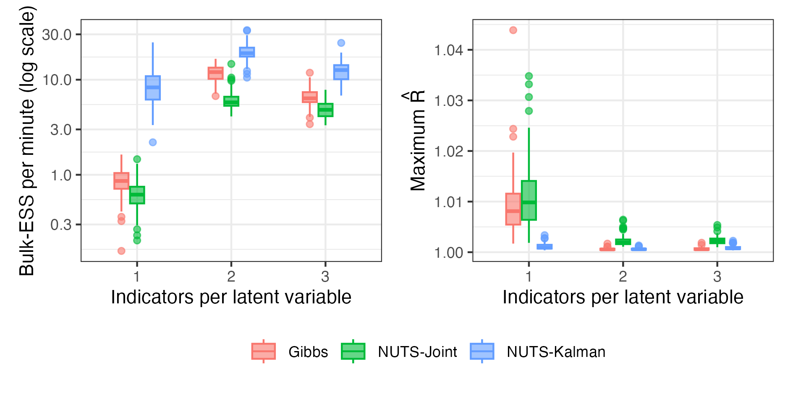
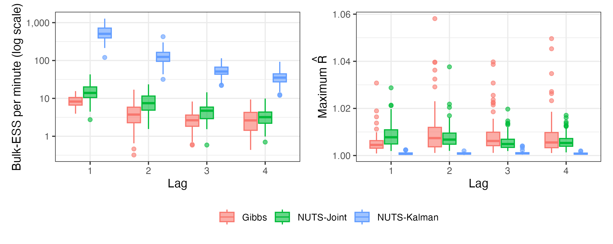
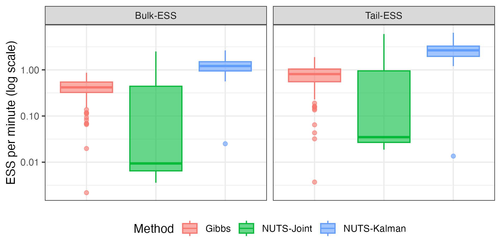
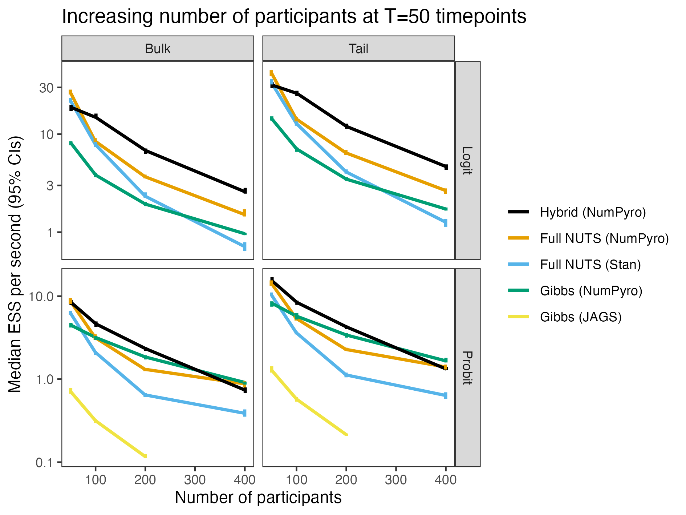
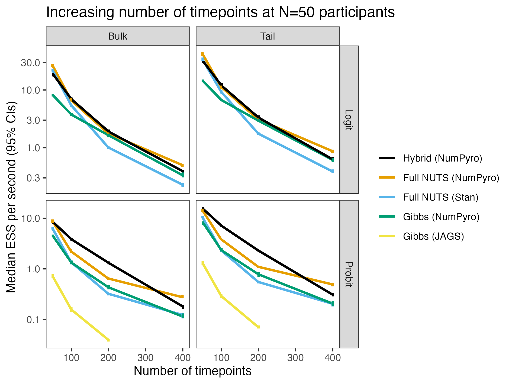

# Dynamic Structural Equation Models (DSEM)

Multilevel models for intensive longitudinal data
[@asparouhovDynamicStructuralEquation2018]

---

{fig-align="center"}

Repeat for $N$ participants.

## Response decomposition

$$
\boldsymbol{y}_{it} = \boldsymbol{y}_{1,it} + \boldsymbol{y}_{2,i} + \boldsymbol{y}_{3,t}, ~ i=1,\dots,N, ~ t = 1, \dots, T
$$

## Within-level model

Measurement model:

$$
\boldsymbol{y}_{1,it}     = \boldsymbol{\nu}_{1,it} + \boldsymbol{\Lambda}_{1,it}(K) \boldsymbol{\eta}_{1,it} + \boldsymbol{R}_{it}(K) \boldsymbol{y}_{1,it} + \boldsymbol{K}_{1,it} \boldsymbol{X}_{1,it} + \boldsymbol{\epsilon}_{1,it} 
$$

Structural model:

$$
\boldsymbol{\eta}_{1,it}  = \boldsymbol{\alpha}_{1,it} + \boldsymbol{B}_{1,it}(K) \boldsymbol{\eta}_{1,it} + \boldsymbol{Q}_{it}(K) \boldsymbol{y}_{1,it} + \boldsymbol{\Gamma}_{1,it} \boldsymbol{X}_{1,it} + \boldsymbol{\xi}_{1,it}
$$

with polynomial matrices $\boldsymbol{X}(K) = \sum_{l=0}^{K} \boldsymbol{X}_{l} L^{l}$, e.g.,

$$
\boldsymbol{\Lambda}_{1,it}(K) \boldsymbol{\eta}_{1,it} = \sum_{l=0}^{K} \boldsymbol{\Lambda}_{1,itl} \boldsymbol{\eta}_{1,i,t-l}
$$

## Further components

- Between-participants model
- Between-timepoints model
- Priors for population-level parameters

# Estimation of DSEMs

## Original algorithm (Mplus)

13-block Metropolis-within-Gibbs, which samples:

- $\mathcal{O}(1)$ population-level parameters.
- $\mathcal{O}(N)$ individual-specific parameters.
- $\mathcal{O}(T)$ timepoint-specific parameters.
- $\mathcal{O}(N \times T)$ within-level latent traits.

Stan implementations using Hamiltonian Monte Carlo also available [@holtmannModelingWithinlevelLatent2025].

## Practical Consequence

- Define the dynamics in terms of latent traits and use a measurement model, and you'll need to sample $\mathcal{O}(N \times T)$ parameters in each MCMC iteration.
- Define the dynamics in terms of sumscores, and you'll need to sample $\mathcal{O}(N + T)$ parameters in each MCMC iteration.

# Can we do better?

## Theorem

Within-level model

$$
\begin{aligned}
        \boldsymbol{y}_{1,it}    & = \boldsymbol{\nu}_{1,it} + \boldsymbol{\Lambda}_{1,it}(K) \boldsymbol{\eta}_{1,it} + \boldsymbol{R}_{it}(K) \boldsymbol{y}_{1,it} + \boldsymbol{K}_{1,it} \boldsymbol{X}_{1,it} + \boldsymbol{\epsilon}_{1,it} \\
        \boldsymbol{\eta}_{1,it} & = \boldsymbol{\alpha}_{1,it} + \boldsymbol{B}_{1,it}(K) \boldsymbol{\eta}_{1,it} + \boldsymbol{Q}_{it}(K) \boldsymbol{y}_{1,it} + \boldsymbol{\Gamma}_{1,it} \boldsymbol{X}_{1,it} + \boldsymbol{\xi}_{1,it},
    \end{aligned}
$$

. . .

can be written as a linear Gaußian state-space model

$$
\begin{aligned}
        \boldsymbol{y}_{1,it}               & = \boldsymbol{Z}_{it} \tilde{\boldsymbol{\eta}}_{1,it} + \boldsymbol{d}_{it} + \boldsymbol{v}_{it}, \quad \boldsymbol{v}_{it} \sim \mathcal{N}\left(\boldsymbol{0}, \boldsymbol{H}_{it}\right)                      \\
        \tilde{\boldsymbol{\eta}}_{1,i,t+1} & = \boldsymbol{T}_{it} \tilde{\boldsymbol{\eta}}_{1,it} + \boldsymbol{c}_{it} + \boldsymbol{w}_{it}, \quad \boldsymbol{w}_{it} \sim \mathcal{N}\left(\boldsymbol{0}, \boldsymbol{W}_{it}\right), 
    \end{aligned}
$$

where $\boldsymbol{Z}_{it}$, $\boldsymbol{d}_{it}$, $\boldsymbol{H}_{it}$, $\boldsymbol{T}_{it}$, $\boldsymbol{c}_{it}$, and $\boldsymbol{W}_{it}$ are functions of "higher-level parameters".

## Marginal HMC

Using the theorem we can:

:::{.incremental}

- Exactly and deterministically integrate over the latent variables using a Kalman filter.
- Target the marginal posterior with Hamiltonian Monte Carlo.
- Sample $\mathcal{O}(N + T)$ rather than $\mathcal{O}(N \times T)$ and hence make latent variable modeling feasible.

:::

# Experiments

## Multilevel Scalar Latent AR(1)

$$
\begin{aligned}
        y_{1,it}    & = \eta_{2,i} + \eta_{1,it} + \epsilon_{1,it}, \quad \epsilon_{1,it} \sim \mathcal{N}(0, \sigma_{2,i}^{2})   \\
        \eta_{1,it} & = \phi_{2,i} \eta_{1,i,t-1} + \xi_{1,it}, \quad \xi_{1,it} \sim \mathcal{N}(0,\psi_{2,i}^{2}),
    \end{aligned}
$$

where intercept $\eta_{2,i}$, autoregression $\phi_{2,i}$, and variances $\sigma_{2,i}^{2}$ and $\phi_{2,i}^{2}$ vary between participants.

## Multilevel Scalar Latent AR(1)

## Multilevel Trivariate VAR(1)

$$
\begin{aligned}
    \boldsymbol{y}_{1,it}    & = \boldsymbol{\Lambda}_{2}  \boldsymbol{\eta}_{1,it} + \boldsymbol{\epsilon}_{1,it} , \quad \boldsymbol{\epsilon}_{1,it} \sim \mathcal{N}(\boldsymbol{0}, \boldsymbol{\Sigma}_{2,i}) \\
    \boldsymbol{\eta}_{1,it} & = \boldsymbol{\Phi}_{2,i} \boldsymbol{\eta}_{1,i,t-1} + \boldsymbol{\xi}_{1,it}, \quad \boldsymbol{\xi}_{1,it} \sim \mathcal{N}(\boldsymbol{0}, \boldsymbol{\Psi}_{2,i}),
\end{aligned}
$$

- Intercept, autoregression matrix, and variances allowed to vary between participants.
- 3-dimensional latent state $\boldsymbol{\eta}_{1,it}$. 

## Multilevel Scalar Latent AR(1)

## Multilevel Latent AR(p)

$$
\begin{aligned}
     & y_{1,it} = \eta_{1,it} + \epsilon_{1,it}, \quad \epsilon_{1,it} \sim \mathcal{N}(0, \sigma_{2,i}^{2})                     \\
     & \eta_{1,it} = \sum_{l=1}^{p}\phi_{2,li} \eta_{1,i,t-l} + \xi_{1,it}, \quad \xi_{1,it} \sim \mathcal{N}(0,\psi_{2,i}^{2}),
\end{aligned}
$$

## Multilevel Latent AR(p)

## Cross-Classified VAR(1)

$$
\begin{aligned}
        \boldsymbol{y}_{1,it}    & =
        \boldsymbol{\Lambda}_{it}
        \boldsymbol{\eta}_{1,it}
        + \boldsymbol{\epsilon}_{1,it} , \quad \boldsymbol{\epsilon}_{1,it} \sim \mathcal{N}(\boldsymbol{0}, \boldsymbol{\Sigma}_{1,i})                                              \\
        \boldsymbol{\eta}_{1,it} & = \boldsymbol{\Phi}_{1,i} \boldsymbol{\eta}_{1,i,t-1} + \boldsymbol{\xi}_{1,it}, \quad \boldsymbol{\xi}_{1,it} \sim \mathcal{N}(\boldsymbol{0}, \boldsymbol{\Psi}_{1,i}),
    \end{aligned}
$$

Loadings vary both between timepoints and between individuals. Model from @mcneishMeasurementIntensiveLongitudinal2021.

## Cross-Classified VAR(1)

# Beyond Conditionally Gaußian

## Hybrid NUTS-Gibbs Sampler

For categorical responses we can combine two Gibbs steps with one NUTS step:

- Gibbs 1: Sample within-level latent trait using forward-filtering backward sampling [@fruhwirth-schnatterDataAugmentationDynamic1994].
2. Gibbs 2: Sample latent responses from truncated normal [@albertBayesianAnalysisBinary1993] or Pólya-Gamma distribution [@polsonBayesianInferenceLogistic2013].
3. NUTS/HMC: Run one step targeting the marginal posterior with latent responses.

## Hybrid NUTS-Gibbs Sampler

- Still $\mathcal{O}(N \times T)$ due to latent responses.
- Cannot use Stan, but NumPyro is a really good alternative.
- Useless for ordinal responses because thresholds are extremely correlated with latent responses [@cowlesAcceleratingMonteCarlo1996].

## Five-Indiciator Binary-Response AR(1) 

## Five-Indiciator Binary-Response AR(1) 

# Going Further

Ordinal responses is the dominating use case and still lacks good algorithms.

## Ordinal DSEM

Better computational scaling requires compromise:

:::{.incremental}
- Clever combination of Laplace approximation and autodiff? [@margossianGeneralAdjointdifferentiatedLaplace2023]
- Approximate filtering, possibly with importance sampling correction [@viholaImportanceSamplingType2020].
- Amortized inference [@habermannAmortizedBayesianMultilevel2025].
:::

## Preprints

:::{.columns}

::::{.column}

State-space marginalization with Gaussian responses:

::::

::::{.column}

Hybrid sampler for discrete responses:

::::

:::

## References